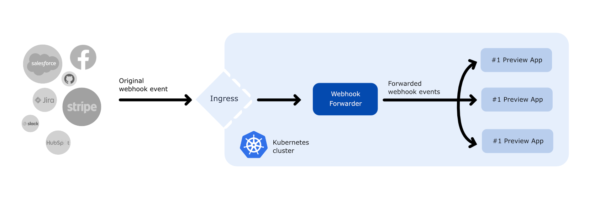
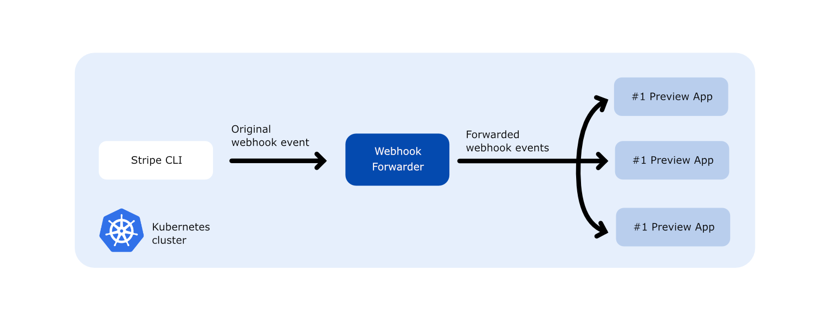

# Webhook forwarder for apps on K8s

Various services use webhooks to deliver data to applications. Webhook data is usually sent to HTTP API endpoints.

To receive webhooks, each API endpoint must be registered in the service's configuration. When the same service instance
is used for several test environments problems arise. The service may limit maximum number of webhook receivers.
Moreover, it could be difficult to manually manage list of endpoints, especially when addresses change often.

The aim of this app is to simplify webhook delivery and management. It provides a single receiver of webhooks that
forwards webhook events to all receivers discovered in the Kubernetes cluster. List of receivers is periodically
refreshed, which makes the app suitable for use with temporary preview environments.

## Available versions

There are 2 versions of the deployment configuration:

1. **External** (`k8s/versions/external-webhooks`) – handles external webhooks (sent from the Internet)
   
2. **Internal** (`k8s/versions/internal-webhooks-stripe-cli`) – uses cluster-internal source of webhooks, e.g. an app
   that generates webhooks. Version presented in the repository is built
   for [Stripe CLI](https://stripe.com/docs/webhooks/test) but after minor adjustments can be used with other similar
   services too.
   

Both versions assume that services that should receive webhooks are defined as services with common name, possibly in
different namespaces.  
However, by introducing changes in soruce code, the app can be adjusted for use with other service
discovery methods.

## Deployment

1. Choose one of the two versions: `external-webhooks` or `internal-webhooks-stripe-cli`
2. Clone this repository
3. Copy `k8s/versions/<version>/webhook-forwarder-user-config.dist.yaml`
   to `k8s/versions/<version>/webhook-forwarder-user-config.yaml` and fill fields marked
   with `TODO`. See **[Configuration](README.md#configuration)** section for more details
4. Use `kustomize` to generate final config (`kustomize build ./k8s/versions/<version>`)
5. Apply the configuration to your Kubernetes cluster
6. Define any additional policies required by your cluster

## Configuration

| Environmental variable name   | Description                                                                                                                                                                                                            | Example                      |
|-------------------------------|------------------------------------------------------------------------------------------------------------------------------------------------------------------------------------------------------------------------|------------------------------|
| LOG_LEVEL                     | Logging verbosity level                                                                                                                                                                                                | `debug`                      |
| HEADERS_TO_FORWARD            | Comma separated list of headers that should be forwarded                                                                                                                                                               | `app-signature,content-type` |
| HEADERS_TO_ADD                | Comma separated list of additional headers that should sent with the forwarded webhook                                                                                                                                 | `key:value,key2:value2` |
| TARGET_NAME                   | Name of the destination service/ingress in K8s that should receive webhooks (see `CLIENT_DISCOVERY_MODE` to choose between service and ingress)                                                                        | `backend-svc`                |
| WEBHOOK_DESTINATION_ENDPOINT  | Path of the endpoint that should receive webhooks                                                                                                                                                                      | `api/webhook`                |
| IGNORE_DESTINATION_SSL_ERRORS | Ignore SSL errors when forwarding webhook to services                                                                                                                                                                  | `false`                      |
| CLIENT_DISCOVERY_MODE         | Determines how clients are discovered. Available modes: `SERVICE` – discovers K8s services, `INGRESS` – discovers hosts in K8s ingresses, `STATIC` – uses client set in `STATIC_CLIENT` (useful for testing/debugging) | `SERVICE`                    |
| STATIC_CLIENT                 | Set address that should receive webhooks                                                                                                                                                                               | `http://localhost:4000`      |

#### Note: ingress mode

When using the `INGRESS` discovery mode, you may encounter issues/limitations, e.g. SSL termination may not work while
accessing pods via a managed load balancer from inside the cluster. Check out the following links for further
explanations/solutions:

- [Issue reported in K8s repo](https://github.com/kubernetes/kubernetes/issues/66607)
- [Another issue](https://github.com/kubernetes/enhancements/issues/1860)
- [Workaround for Digital Ocean Kubernetes](https://github.com/digitalocean/digitalocean-cloud-controller-manager/blob/master/docs/controllers/services/examples/README.md#accessing-pods-over-a-managed-load-balancer-from-inside-the-cluster)
- [Other community solution](https://github.com/compumike/hairpin-proxy)

# Building & running

- App is designed to run on Docker
- It can be also started locally:
    - First install dependencies `npm install`
    - Then build `npm run build` and start `node dist/app.js`
    - Or run in development mode `npm run dev`

# Running tests

```sh
npm install
npm test
```

# Other possible solutions

It's worth to mention some other methods that can also be sufficient in some situation:

- Nginx mirroring module: [ngx_http_mirror_module module](https://nginx.org/en/docs/http/ngx_http_mirror_module.html)
- In case of services that provide tools for forwarding webhooks to local destinations: running instance of the tool as
  a sidecar container for each webhook receiver 
